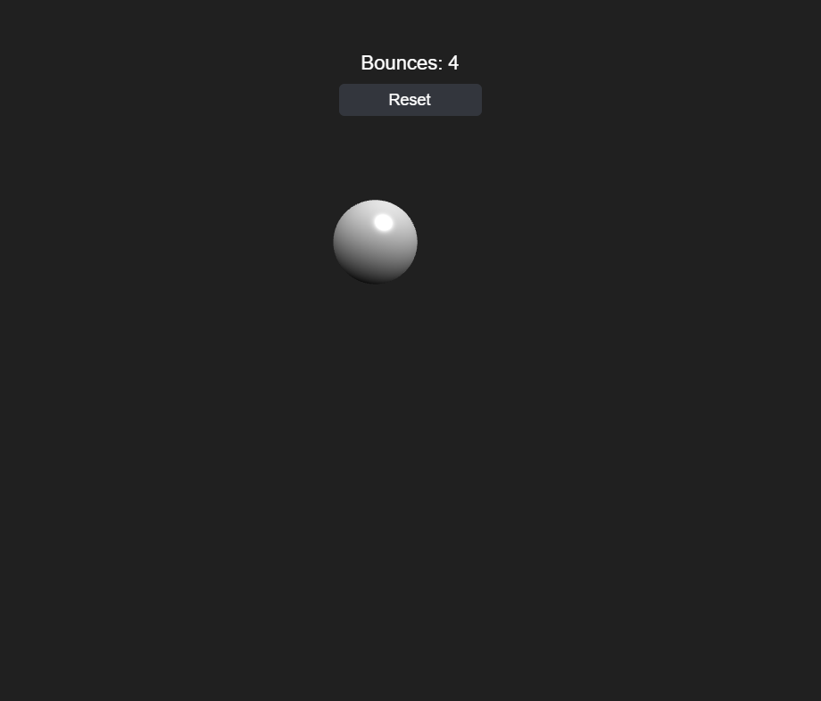

# Bouncing Ball Orthographic

Builds on [Bouncing Ball HUD](../bouncing_ball_hud/README.md): the ball is now a real lit `BABYLON.MeshBuilder.CreateSphere` mesh with a `StandardMaterial`, instead of a flat `BABYLON.GUI.Ellipse`, viewed through an orthographic camera instead of the unused default `FreeCamera` earlier samples never actually pointed anywhere. An orthographic camera has no perspective distortion, so the ball still reads as flat "2D" gameplay — but it now has real shading from a `HemisphericLight`, which a flat GUI circle never could.

The bridge this sample is really about: `Ball`'s physics (`update`, `beginDrag`, `dragTo`, `release`, `reset`) never cared what unit `x`/`y` were in, so swapping screen pixels for world units — and swapping the GUI-control sync for a mesh-position sync — required zero changes to that logic, only to `attachTo()`/`dispose()`/the sync step (renamed `_syncMesh()`). `SparkSystem` and `Hud` don't change at all: they're still `BABYLON.GUI` screen-space overlays, exactly as before, since mixing a 3D world with a 2D GUI overlay is the normal way Babylon apps work. The only new code in `main.js` is a small world-unit ↔ screen-pixel conversion so the GUI overlay (sparks, the slingshot indicator) lines up with what the orthographic camera is actually showing.

One gotcha worth calling out: Babylon's world Y axis points up, but every other part of this sample (physics, dragging, spark spawn points) still works in the same y-grows-downward space the GUI-based samples used. `Ball._syncMesh()` is the single place that flips the sign (`mesh.position.y = -this.y`) — everything else stays in the same coordinate space it always was.

## Babylon.js features demonstrated

- Everything from Bouncing Ball HUD
- A real mesh (`BABYLON.MeshBuilder.CreateSphere`) with a `BABYLON.StandardMaterial`, instead of a flat GUI control
- An orthographic camera (`camera.mode = BABYLON.Camera.ORTHOGRAPHIC_CAMERA`, `orthoLeft`/`orthoRight`/`orthoTop`/`orthoBottom`) mapping a fixed vertical world-unit extent onto the viewport, recomputed on resize so it always matches the window's aspect ratio
- A `BABYLON.HemisphericLight`, giving the ball actual directional shading
- Converting between world-space units and screen-space pixels, so a 3D mesh and a 2D `BABYLON.GUI` overlay can share one scene and agree on where things are

## Controls

- **Click/tap the ball and drag, then release** — pull back and launch it, slingshot-style. Works again mid-flight to relaunch.
- **Reset button** (top of screen) — snaps the ball back to the center at rest and zeroes the bounce count
- **Space** — save a PNG screenshot of the current frame

## Running the tests

Open [tests.html](tests.html) in a browser (or click "Run tests" from the running sample) to execute the QUnit suite against `js/ball.js`, `js/sparks.js`, and `js/hud.js`.

## Notes

Browsers block audio until a user gesture. Babylon shows its own small unmute prompt automatically the first time — click it once to hear the bounce sound.
