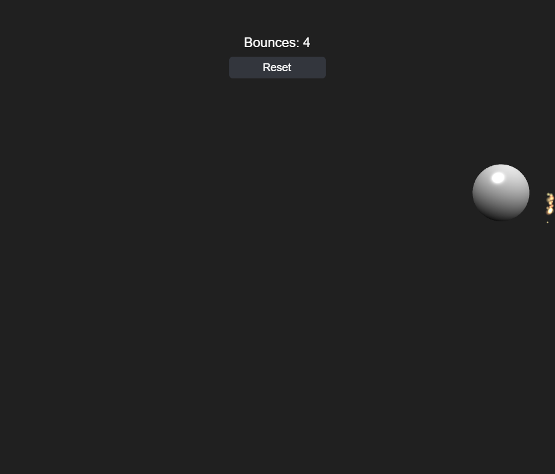

# Bouncing Ball Particles & Friction

Builds on [Bouncing Ball Orthographic](../bouncing_ball_orthographic/README.md): the ball now loses energy on every wall bounce instead of reflecting perfectly forever, and the bounce sparks are real `BABYLON.ParticleSystem` bursts instead of hand-animated `BABYLON.GUI` rectangles.

**Restitution and rest.** `Ball` takes a `restitution` option (default `0.82`) and scales the reflected velocity by it on every wall hit (`this.vx = -this.vx * this.restitution`), so each bounce is a little weaker than the last. Once the post-bounce speed drops below `restThreshold` (default `0.05`), the ball snaps fully to `0` velocity instead of bouncing on forever at an imperceptible speed — a launch eventually settles at rest near the middle of the box. `ball.tests.js` pins `restitution: 1` in the existing reflection tests (so they keep testing pure reflection in isolation) and adds a dedicated `"Ball restitution / rest threshold"` module for the energy-loss/rest-snap behavior.

**Real particles.** `SparkSystem` no longer hand-simulates gravity/drag/lifetime for a pool of GUI rectangles. Instead, every bounce spawns one `BABYLON.ParticleSystem` burst — a real mesh-space particle emitter, not a screen-space GUI overlay — configured with a `manualEmitCount` (14–21, same randomized range as before) and a high `emitRate` so the whole burst empties in about a frame, `direction1`/`direction2` fanning ±72° around the bounce normal, additive blending, and a procedurally generated `BABYLON.DynamicTexture` soft-glow sprite (no external asset, same reasoning as the synthesized bounce sound) shared across every burst. Babylon's own particle engine now handles per-particle motion, gravity, and fade-out; `SparkSystem` just tracks each burst's own `ttl` (its `manualEmitCount` ramp-up time plus `maxLifeTime` plus a small buffer) and disposes it once that elapses. That's deliberately not driven by Babylon's `isAlive()`/`getActiveCount()` flags: right after `start()`, those still read as "empty" for a frame or two while the engine's internal particle update catches up, so a naive poll disposes the burst before it ever draws a single particle. Because particles live in world space alongside the ball, `main.js` no longer converts bounce points through `worldToScreenScale` before handing them to `spawn()` — only the still-GUI-based slingshot indicator needs that conversion.

## Babylon.js features demonstrated

- Everything from Bouncing Ball Orthographic
- `BABYLON.ParticleSystem` one-shot bursts (`manualEmitCount` + a high `emitRate`) for the bounce sparks, with additive blending and a procedurally generated `BABYLON.DynamicTexture` sprite
- Velocity-based restitution on wall bounces, so the ball's kinetic energy — and its bounce sound/spark intensity, both driven by `bounce.speed` — decays bounce over bounce until it settles at rest

## Controls

- **Click/tap the ball and drag, then release** — pull back and launch it, slingshot-style. Works again mid-flight to relaunch.
- **Reset button** (top of screen) — snaps the ball back to the center at rest and zeroes the bounce count
- **Space** — save a PNG screenshot of the current frame

## Running the tests

Open [tests.html](tests.html) in a browser (or click "Run tests" from the running sample) to execute the QUnit suite against `js/ball.js`, `js/sparks.js`, and `js/hud.js`.

## Notes

Browsers block audio until a user gesture. Babylon shows its own small unmute prompt automatically the first time — click it once to hear the bounce sound.
